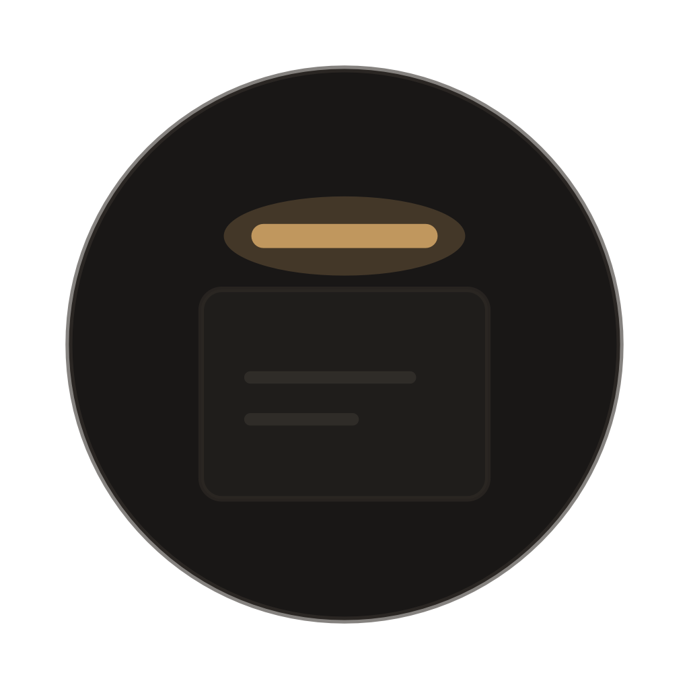

# Overline

Floating session labels for your terminal windows. Overline is a native macOS menu bar app that detects [Claude Code](https://docs.anthropic.com/en/docs/claude-code) sessions and displays contextual labels above each terminal window — showing you which project is running where.



## Features

- **Session labels** — Floating labels above each terminal window showing the project name and what Claude is working on
- **Multi-app clustering** — Groups terminal windows with their associated browser tabs (localhost dev servers) and desktop apps into color-coded project clusters
- **Browser detection** — Finds Chrome, Arc, and Safari windows showing your project's localhost dev server
- **Bento mode** — Snap all terminal windows into a responsive grid layout with draggable dividers
- **Animation styles** — Choose between Accent Bar (shimmer) and Border Loop (traveling segment) animations
- **Notification badges** — See when a background session goes idle
- **Occlusion detection** — Labels automatically hide when the terminal window is behind other windows
- **Double-click to rename** — Customize label text per-window
- **Target app support** — Works with Terminal, iTerm2, Warp, or any app by bundle ID

## Requirements

- macOS 14.0 (Sonoma) or later
- Accessibility permissions (System Settings > Privacy & Security > Accessibility)
- Swift 5.10+

## Build

```bash
# Build and run (release mode, default)
./build.sh

# Debug build
./build.sh debug

# Build + create DMG
./build.sh --dmg

# Build + sign + notarize + DMG (for distribution)
./build.sh --sign "Developer ID Application: Your Name (TEAMID)" --notarize --dmg
```

The built app is placed in `build/Overline.app`. The script automatically launches it after building.

## How It Works

1. Overline scans for `claude` processes via `ps` and groups them by TTY
2. For each Claude process, it resolves the working directory via `lsof`
3. It derives a project name from the directory path
4. AXObserver tracks target app windows with ~1-5ms latency for smooth label positioning
5. Labels float as borderless transparent windows above each terminal window

### Multi-App Clustering (Optional)

When enabled (menu bar > Mode > Multi-App), Overline also:

- Reads a `ports.json` file to map projects to dev server ports
- Probes which ports have running servers via `lsof`
- Uses AppleScript to enumerate browser tabs on matching localhost URLs
- Draws colored borders around browser/desktop app windows belonging to the same project

## Configuration

Overline works out of the box with zero configuration. Optional environment variables enable advanced features:

| Variable | Purpose | Example |
|----------|---------|---------|
| `OVERLINE_WORKSPACE` | Workspace root for relative project naming | `~/projects` |
| `OVERLINE_PORTS_JSON` | Path to ports.json for dev server detection | `~/projects/ports.json` |
| `OVERLINE_DESKTOP_APPS` | Desktop app bundle ID to project dir mappings | `com.app.foo:tools/foo,com.app.bar:tools/bar` |

### ports.json Format

```json
{
  "projects": {
    "my-app": { "backend": 3000, "vite": 5173, "dir": "apps/my-app" },
    "dashboard": { "backend": 4000, "vite": 5174, "dir": "apps/dashboard" }
  }
}
```

### Session Enrichment

If your workspace has an `.active-sessions.json` file at the root (written by tooling like Claude Code's multi-session protocol), Overline reads it to display richer context — what each session is working on, the git branch, etc.

## Architecture

```
Sources/
  App/
    main.swift              Entry point
    AppDelegate.swift       Menu bar, window tracking, overlay lifecycle
    OverlayWindow.swift     Floating label windows with animations
    BorderOverlayWindow.swift  Border overlays for browser/app windows
    BentoManager.swift      Grid layout manager with drag-to-rearrange
    Settings.swift          UserDefaults persistence
  Core/
    AppWatcher.swift        AXObserver for target app window events
    SessionDetector.swift   Finds Claude processes by TTY
    SessionEnricher.swift   Reads .active-sessions.json for rich context
    ProjectNamer.swift      Derives project name from working directory
    WorkspaceRoot.swift     Configurable workspace root resolution
    ClusterEngine.swift     Orchestrates all detectors for multi-app mode
    ProjectCluster.swift    Data models for project clusters
    ClusterColorPalette.swift  8 accent colors with stable hash assignment
    PortResolver.swift      Maps projects to dev server ports
    ServerProber.swift      Batch lsof to check active servers
    BrowserDetector.swift   AppleScript browser tab enumeration
    DesktopAppDetector.swift  CGWindowList lookup for desktop apps
```

## License

MIT
